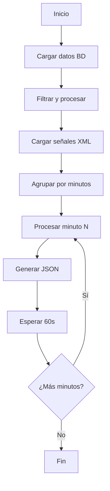

# Simulador de Tiempo Real para Datos Respiratorios

## 📋 Descripción

Este script simula un sistema de monitoreo respiratorio en tiempo real, generando archivos JSON con datos de ventilación mecánica cada 60 segundos. Procesa datos históricos de ventiladores y señales respiratorias (presión y flujo) para crear una experiencia de monitoreo continuo.

## 🎯 Propósito

- **Simular datos en tiempo real** para sistemas de monitoreo respiratorio
- **Generar archivos JSON** con datos de ventilación cada minuto
- **Facilitar el desarrollo y testing** de sistemas de análisis respiratorio
- **Proporcionar datos estructurados** para algoritmos de clasificación

## 🔧 Requisitos

### Dependencias Python
```bash
pip install pandas numpy sqlalchemy python-dateutil
```

### Estructura de Archivos Requerida
```
C:\Users\vsantos\Documents\REALTIME_FS\
├── Patients\
│   └── [NHC]\
│       └── [BED]\
│           └── [DATE]\
│               ├── message_001.xml
│               ├── message_002.xml
│               └── ...
└── SimulatedRealtimeJSON\  # (se crea automáticamente)
    ├── minute_000.json
    ├── minute_001.json
    └── ...
```

### Base de Datos PostgreSQL
- **Tabla**: `public.breathdata`
- **Campos requeridos**:
  - `NHC`: Identificador del paciente
  - `Time`: Timestamp del ciclo respiratorio
  - `Breath Order`: Orden del ciclo
  - `Inspiratory_Time`: Tiempo inspiratorio
  - `Expiratory_Time`: Tiempo espiratorio
  - `BCMode_20`: Modo de ventilación
  - `Trigger`: Tipo de trigger
  - `center`: Centro médico

## 📊 Formato de Datos de Entrada

### Archivos XML
Cada archivo XML contiene señales respiratorias con:
- **PAW**: Presión en las vías respiratorias
- **AIR FLOW**: Flujo de aire
- **TI/TE**: Timestamps de inicio/fin
- **Metadatos**: Rangos mínimos y máximos

### Base de Datos
```sql
SELECT * FROM public.breathdata 
WHERE NHC = 'paciente_id' 
ORDER BY Time, "Breath Order";
```

## 🚀 Uso

### Configuración Básica
```python
# Modificar en el script:
db_config = {
    'user': 'tu_usuario',
    'password': 'tu_password',
    'host': 'localhost',
    'port': 5432,
    'database': 'tu_database'
}

basedir = r"C:\tu\ruta\REALTIME_FS"
```

### Ejecución
```bash
python realtime_simulator_fixed_5.py
```

### Salida Esperada
```
==================================================
INICIANDO SIMULACIÓN DE TIEMPO REAL
==================================================
Cargando datos de la base de datos...
Datos cargados: 1250 registros
Pacientes únicos: 5
...
[14:30:15] Procesando minuto 0 (1/15)
  ✓ Archivo generado: minute_000.json con 8 registros
  ⏳ Esperando 60 segundos antes del siguiente minuto...
```

## 📄 Formato de Salida JSON

Cada archivo `minute_XXX.json` contiene:

```json
[
  {
    "NHC": "12345",
    "Time": "2024-01-15 14:30:15.123456+00:00",
    "Inspiratory_Time": 1.250,
    "Expiratory_Time": 2.100,
    "ti_new": 1.250,
    "BCMode_20": "VCV",
    "Trigger": "TIME",
    "Pressure": [12.5, 15.3, 18.7, ...],
    "Flow": [0.45, 0.52, 0.48, ...]
  }
]
```

### Campos Explicados
- **NHC**: Identificador único del paciente
- **Time**: Timestamp del ciclo respiratorio
- **Inspiratory_Time**: Duración de la inspiración (segundos)
- **Expiratory_Time**: Duración de la espiración (segundos)
- **ti_new**: Tiempo inspiratorio recalculado
- **BCMode_20**: Modo de ventilación (VCV, PCV, etc.)
- **Trigger**: Tipo de disparo (TIME, FLOW, etc.)
- **Pressure**: Array de valores de presión (200 Hz)
- **Flow**: Array de valores de flujo (200 Hz)

## ⚙️ Características Técnicas

### Frecuencia de Muestreo
- **200 Hz** (una muestra cada 0.005 segundos)
- Calculado como: `freq = 1 / 0.005 = 200 Hz`

### Procesamiento de Señales
1. **Extracción**: Decodificación de datos XML en formato cp850
2. **Escalado**: Aplicación de rangos mínimos/máximos
3. **Segmentación**: Corte basado en tiempo inspiratorio
4. **Sincronización**: Alineación con timestamps de base de datos

### Optimizaciones
- **Carga única**: Señales cargadas una sola vez por paciente
- **Indexación eficiente**: Cálculo de índices basado en timestamps
- **Memoria**: Datos mantenidos en memoria durante ejecución

## 🔄 Flujo de Procesamiento



## 📈 Métricas de Rendimiento

### Tiempos Típicos
- **Carga inicial**: 2-5 minutos (depende del volumen)
- **Procesamiento por minuto**: 1-3 segundos
- **Espera entre minutos**: 60 segundos exactos

### Uso de Memoria
- **Señales cargadas**: ~50-200 MB por paciente
- **Datos procesados**: ~1-5 MB por minuto
- **Total estimado**: 500 MB - 2 GB (según datos)

## 🛠️ Personalización

### Modificar Intervalo de Tiempo
```python
# Para intervalos diferentes:
time.sleep(30)    # 30 segundos
time.sleep(120)   # 2 minutos
time.sleep(5)     # 5 segundos (testing)
```

### Cambiar Formato de Salida
```python
# Agregar campos adicionales:
records.append({
    "NHC": nhc,
    "Time": str(cycle_time),
    # ... campos existentes ...
    "SampleRate": 200,
    "ProcessingTime": processing_time,
    "DataSource": data_key
})
```

### Filtros Personalizados
```python
# Filtrar por modo de ventilación:
df = df[df['BCMode_20'].isin(['VCV', 'PCV'])]

# Filtrar por tiempo inspiratorio:
df = df[(df['ti_new'] > 0.5) & (df['ti_new'] < 3.0)]
```

## 🐛 Solución de Problemas

### Error: No se encuentra carpeta de paciente
```
Verificar que existe: C:\Users\vsantos\Documents\REALTIME_FS\Patients\[NHC]\
```

### Error: Conexión a base de datos
```python
# Verificar configuración:
db_config = {
    'user': 'usuario_correcto',
    'password': 'password_correcto',
    'host': 'localhost',  # o IP del servidor
    'port': 5432,
    'database': 'nombre_correcto'
}
```

### Error: Archivos XML no encontrados
```
Verificar estructura:
Patients\[NHC]\[BED]\[DATE]\message_XXX.xml
```

### Sin datos válidos después del filtro
- Verificar que `ti_new` sea positivo
- Comprobar continuidad temporal en los datos
- Revisar que NHC coincida entre BD y archivos

## 📋 Logs y Monitoreo

### Información Mostrada
```
[14:30:15] Procesando minuto 0 (1/15)
  Registros en este minuto: 8
  Pacientes únicos: 2
  NHCs: ['12345', '67890']
    Procesando NHC: 12345, Tiempo: 2024-01-15 14:30:15, TI: 1.250s
      Usando datos de BED1_20240115
      Registro agregado exitosamente (samples: 250)
  ✓ Archivo generado: minute_000.json con 8 registros
  ✓ Tiempo de procesamiento: 2.15 segundos
```

### Archivos Generados
- `minute_000.json`, `minute_001.json`, etc.
- Un archivo por cada minuto de datos
- Numeración secuencial con padding de 3 dígitos

## 🔒 Consideraciones de Seguridad

- **Datos sensibles**: Los archivos JSON contienen información médica
- **Acceso a BD**: Credenciales en texto plano (usar variables de entorno)
- **Archivos temporales**: Limpiar directorio de salida si es necesario

## 📞 Soporte

Para problemas técnicos:
1. Verificar logs de salida
2. Comprobar estructura de archivos
3. Validar conexión a base de datos
4. Revisar permisos de escritura

---

**Versión**: 1.0  
**Autor**: Sistema de Monitoreo Respiratorio  
**Fecha**: 2024